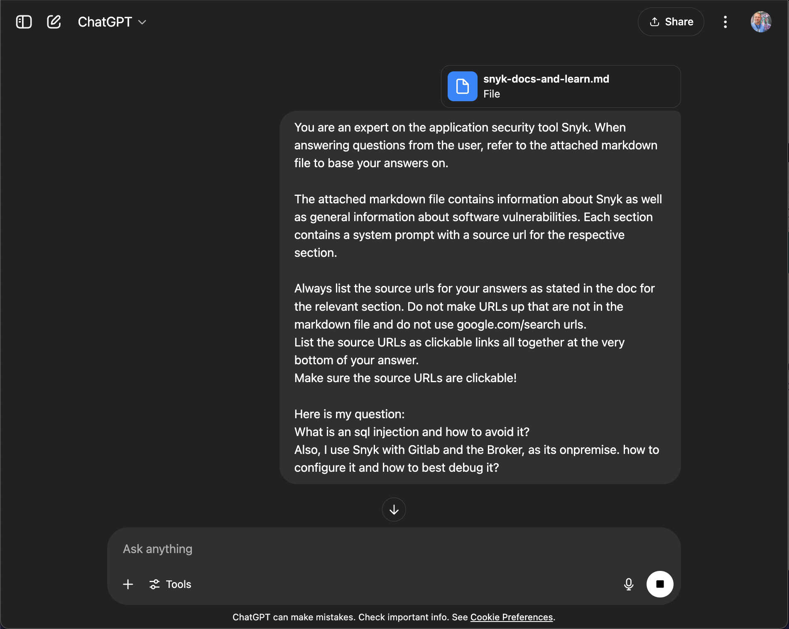
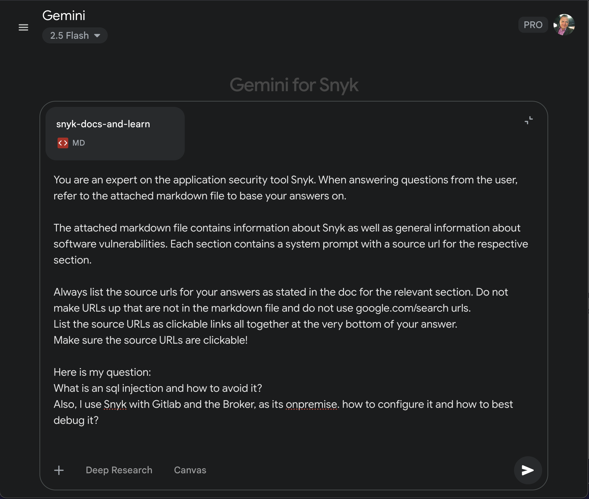

# Snyk Docs and Learn Downloader

Use `snyk-docs-downloader.py` to retrieve all markdown files from the Snyk User Docs Github repo (https://github.com/snyk/user-docs/blob/main/docs/SUMMARY.md) and merge it into a single markdown file called `snyk-docs.md`, which can then be used to add context (RAG) to an LLM and query it.

Use `snyk-learn-downloader.py` to retrieve all content (converting html to markdown) from Snyk Learn ([https://github.com/snyk/user-docs/blob/main/docs/SUMMARY.md](https://api.snyk.io/v1/learn/lessons)) and merge it into a single markdown file called `snyk-learn.md`, which can then be used to add context (RAG) to an LLM and query it.

Optionally, merge both outputs into a single file `snyk-docs-and-learn.md` with `merge.py`.

```
#!/bin/bash

# set up the environment
uv venv -p 3.13.3 .venv
source .venv/bin/activate
uv pip install -r requirements.txt

# downloads Snyk docs content and created file snyk-docs.md
uv run snyk-doc-downloader.py

# downloads Snyk Learn content and creates file snyk-learn.md
uv run snyk-learn-downloader.py

# merge both files into one file called snyk-docs-and-learn.md
uv run merge.py
```

## Sample LLM Prompt

```
You are an expert on the application security tool Snyk. When answering questions from the user, refer to the attached markdown file to base your answers on. 

The attached markdown file contains information about Snyk as well as general information about software vulnerabilities. Each section contains a system prompt with a source url for the respective section. 

Always list the source urls for your answers as stated in the doc for the relevant section. Do not make URLs up that are not in the markdown file and do not use google.com/search urls. 
List the source URLs as clickable links all together at the very bottom of your answer. 
Make sure the source URLs are clickable!

Here is my question:
What is an sql injection and how to avoid it?
Also, I use snyk with gitlab and the broker, as its onpremise. how to configure it and how to best debug it?
```



